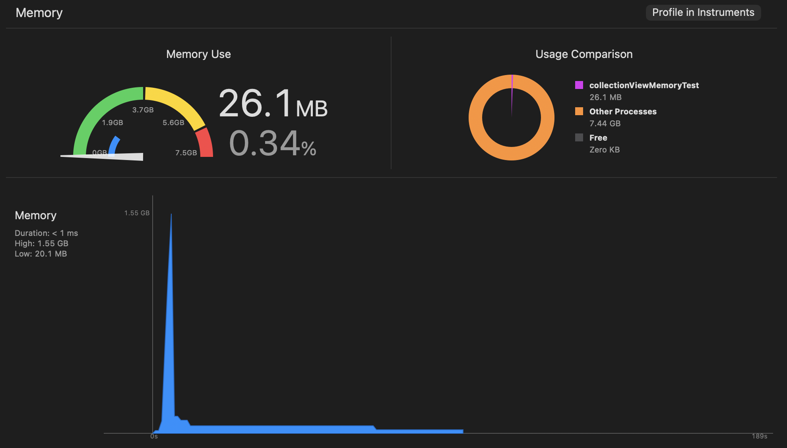
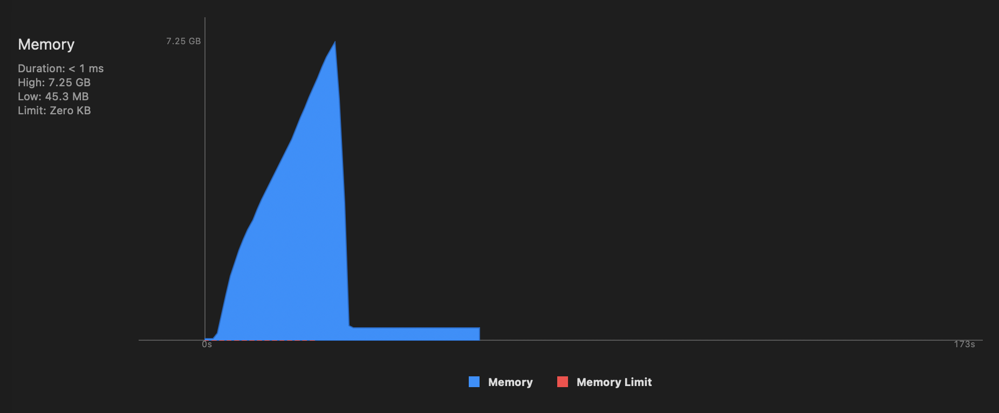

# collectionViewMemoryTest

This project demonstrates a memory runaway when rapidly selecting many cells in a `UICollectionView` list.

## Problem

Selecting a large number of cells quickly causes memory usage to grow dramatically while selection is in progress:

- Selecting 10,000 items needs roughly 1.5 GB of memory.
- Selecting 20,000 items needs roughly 7 GB of memory.
- The behavior usually crashes on real devices.
- The same operation can often complete successfully in the simulator.

After selection completes, memory returns to acceptable levels. The high memory pressure appears to be transient during the rapid multi-selection operation.
## Screenshots

### 10,000 Items

### 20,000 Items

